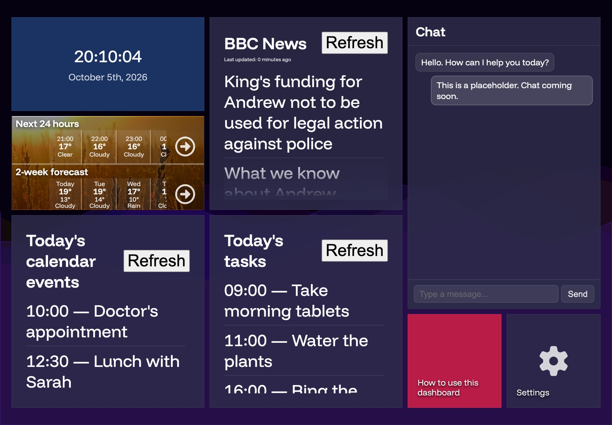
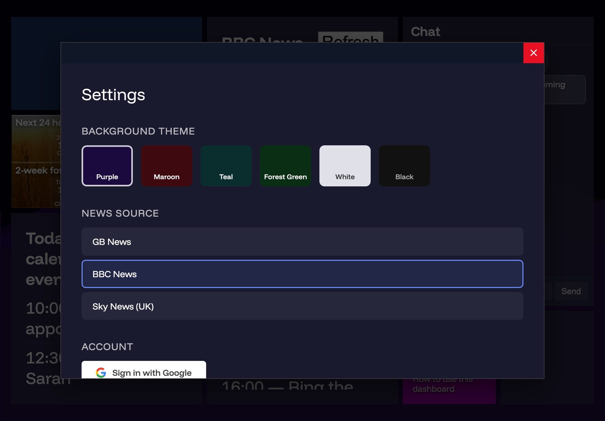
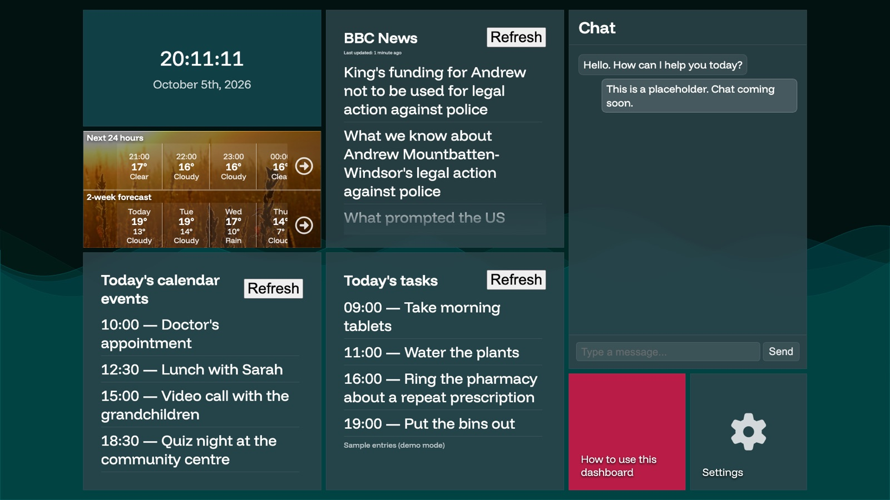
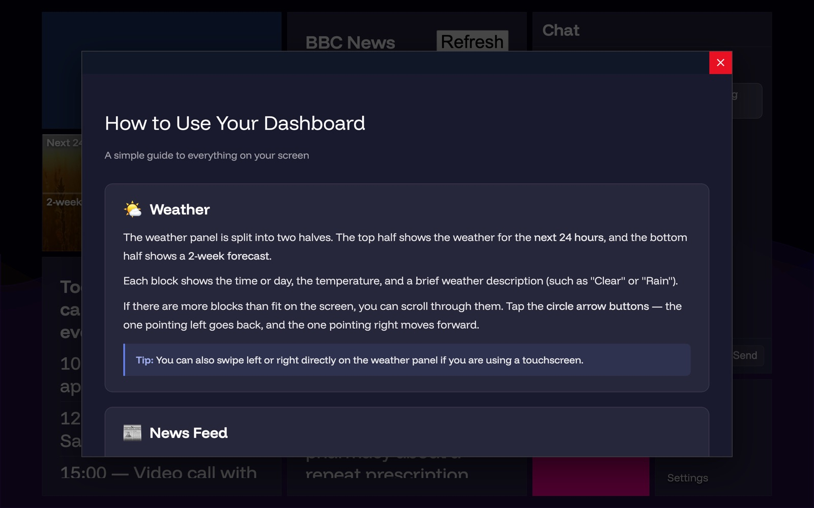
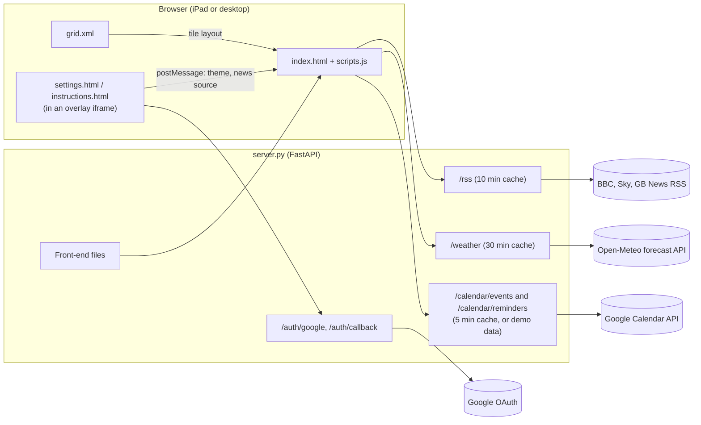

# Smart home dashboard (24-hour hackathon project)

An easy-to-use smart home dashboard for any touchscreen device, built at a 24-hour collaborative hackathon at my university.

It is a touch-first web page for a simple "smart screen": leave a tablet on a stand and it shows the time, the weather, the news headlines and what is on today. Anything with a modern-ish web browser can show it. I recommend an iPad, as it fits the display UI just about perfectly. The page is titled "Elderly Dashboard" in the code, and that is who it was designed for: people who want the day's essentials at a glance without learning an app, so the text is large, the tiles are big touch targets and there is a built-in "How to use this dashboard" guide.

It shows the current weather, a selectable RSS news feed from a few UK sources, and today's Google Calendar events and tasks. The Google Calendar integration still needs a real-account test (see [Status](#status-and-limitations)).

## Screenshots

The calendar and tasks tiles in these screenshots show **demo data** (`DEMO_MODE=1`, no Google account involved). The weather and news were fetched live when the screenshots were taken.



*iPad landscape (1180 x 820). Clock, 24-hour and two-week forecast, BBC News, the chat placeholder, and today's calendar events and tasks.*



*Settings opens over the dashboard with a flip animation: pick a background theme and news source, or sign in with Google.*



*Desktop (1920 x 1080) with the teal theme. The grid scales to fit the screen.*



*The built-in guide, written for people who are not used to touchscreens.*

## Features

- **Clock and date**, updated every second.
- **Weather** from [Open-Meteo](https://open-meteo.com/) (no API key needed): the next 24 hours and a two-week forecast, with swipe or arrow-button scrolling.
- **News headlines** from BBC News, Sky News or GB News. Tap a headline to open the article; a Refresh button and "last updated" time sit at the top.
- **Today's calendar events** and **today's tasks** (from a Google calendar called "Reminders") once you sign in with Google, or sample entries in demo mode.
- **Six background themes** (purple, maroon, teal, forest green, white, black) over an animated wave background. Theme and news source are remembered in the browser.
- **Settings and help pages** that open in a full-screen overlay without leaving the dashboard.
- **Layout from XML**: `grid.xml` decides which tile goes where, so you can rearrange the screen without touching the code.
- A **chat tile** placeholder for a future assistant.

## How to run

You need Python 3.10 or newer (tested with 3.14). One process, `server.py`, serves both the page and its API.

```bash
git clone https://github.com/LBSiUK/hackathon-2026-webdashboard.git
cd hackathon-2026-webdashboard
python3 -m venv .venv
source .venv/bin/activate
pip install -r requirements-fastapi.txt
DEMO_MODE=1 uvicorn server:app --host 0.0.0.0 --port 5020
```

Then open <http://localhost:5020>. Leave out `DEMO_MODE=1` if you do not want the sample calendar entries.

To use it from an iPad (or any other device) on the same network, open `http://<your computer's name or address>:5020` in Safari. The page calls the API on whatever address it was loaded from, so nothing else needs changing.

While working on the code, add `--reload --reload-exclude '.venv/*'`. The exclude stops the file watcher from restarting the server over and over when files in `.venv/` change.

### Settings

`server.py` reads these from the environment or from a `.env` file. Copy `.env.example` to `.env` to get started (`.env` is ignored by git).

| Variable | What it does |
| --- | --- |
| `DEMO_MODE` | `1` shows sample calendar events and tasks until someone signs in. |
| `GOOGLE_CLIENT_ID`, `GOOGLE_CLIENT_SECRET` | Google OAuth client for calendar sign-in. Without them, sign-in reports "not configured". |
| `BASE_URL` | Address used to build the OAuth redirect URI (default `http://localhost:5020`). |
| `TZ` | Time zone for the forecast and for what counts as "today" on the calendar (default `Europe/London`). |
| `CALENDAR_TOKEN_FILE`, `AUTH_STATE_FILE` | Where the Google token and the short-lived sign-in state are stored. |

The weather location is set on the weather tile in `grid.xml` (`data-lat` and `data-lon`, currently central Brighton).

### Google Calendar

Calendar sign-in needs your own Google Cloud OAuth client. No credentials are included in this repository.

1. In the Google Cloud console, create a project and enable the **Google Calendar API**.
2. Set up the OAuth consent screen. In testing mode, add your Google account as a test user.
3. Create an OAuth client ID of type **Web application** and add `http://localhost:5020/auth/callback` as an authorised redirect URI.
4. Put the client ID and secret in `.env` as `GOOGLE_CLIENT_ID` and `GOOGLE_CLIENT_SECRET`, then restart the server.
5. On the computer running the server, open <http://localhost:5020>, tap **Settings**, then **Sign in with Google**.

Google only accepts plain-HTTP redirect URIs on `localhost`, so do the sign-in on the server machine (or put the dashboard behind HTTPS on a real domain and set `BASE_URL` to match). Once signed in, the token is saved in `calendar_tokens.json` and every device sees the calendar. The server only asks for read-only calendar access. The tasks tile lists today's entries from a calendar named "Reminders", if you have one.

### Tests

```bash
pip install -r requirements-dev.txt
python -m pytest
```

The tests run offline. They cover the RSS allow-list, demo mode, which files the server will serve, and the Google sign-in round trip (with Google's side faked).

### The older Flask proxy (optional)

`proxy.py` is a small Flask app from earlier in the project. The current front end does not use it, but it still works if you want a general-purpose helper for CORS and frame restrictions:

- `/rss_cached?url=...` fetches any http(s) feed, caches it in memory for 10 minutes and adds CORS headers.
- `/proxy?url=...` fetches a page and returns it with CORS headers, so a page that sets `X-Frame-Options` can be shown in an iframe.

```bash
pip install -r requirements.txt
PORT=5001 python proxy.py
```

It listens on port 5000 by default, but on recent versions of macOS that port belongs to AirPlay Receiver, hence `PORT=5001`. Set `FLASK_DEBUG=1` for the Flask debugger.

## Architecture



**Front end.** `index.html` is an empty shell: a canvas for the animated waves and a grid container. `scripts.js` fetches `grid.xml`, which describes a 6 x 4 grid. Each `<item>` lists the cells it covers as `{row letter, column}` pairs (for example `{A,2}, {B,3}`), and the script turns that into a CSS grid area. The tile `type` decides what goes in it: `clock`, `content` (HTML from the CDATA block, with the weather, news, calendar and tasks tiles filled in from the API), `menu` (an icon and a label), or with no type, a plain tile in a random colour. Tiles with a `link` and id 8, 10 or 12 open that page in an animated overlay, which is how Settings and the guide work. The settings page saves choices in `localStorage` and tells the dashboard with `postMessage`, so the theme and news source change straight away. The tile grid itself started life on a Windows 8 start-screen style personal website; `gridlayout_depreciated.xml` is that old layout, kept for reference and not loaded.

**Back end.** `server.py` is a FastAPI app. It fetches the RSS feeds (only from an allow-list) and the Open-Meteo forecast on the dashboard's behalf, which avoids CORS problems in the browser, and keeps each response in an in-memory cache. The calendar routes use the Google API client with a stored OAuth token and return a small XML list of today's events. The same app serves the front-end files, limited to the file types the page uses so tokens and config in the project folder can never be downloaded.

### Project layout

| Path | Purpose |
| --- | --- |
| `index.html` | Page shell; loads `styles.css`, `scripts.js`, Google Fonts and the Font Awesome icon kit. |
| `scripts.js` | Themes, wave animation, grid layout, and the clock, weather, news, calendar and tasks tiles. |
| `styles.css` | Styles for the dashboard, tiles, overlay and settings page. |
| `grid.xml` | The current tile layout. |
| `gridlayout_depreciated.xml` | Old layout from the earlier website, not used. |
| `settings.html` | Theme, news source and Google sign-in. |
| `instructions.html` | The "How to use your dashboard" guide. |
| `images/sunrise.webp`, `back.svg`, `fav.ico` | Weather tile background, back arrow, favicon. |
| `server.py` | FastAPI backend (current). |
| `requirements-fastapi.txt` | Dependencies for `server.py`. |
| `requirements-dev.txt` | The above plus pytest. |
| `tests/test_server.py` | Offline tests for `server.py`. |
| `proxy.py`, `requirements.txt` | Older Flask proxy (optional, not used by the page). |
| `.env.example` | Template for the settings above. |

## Status and limitations

This is a hackathon project, so some parts are unfinished:

- **Google Calendar** sign-in had a bug that made the token exchange fail (the PKCE code verifier was lost between the sign-in redirect and the callback). That is fixed and covered by a test with Google faked out, but it has not been tried against a real Google account since.
- The **chat tile** is a static placeholder.
- The weather location is fixed in `grid.xml` rather than set from the Settings page.
- The icons come from a Font Awesome kit script. If that kit stops loading, the gear and arrow icons disappear but everything else still works.
- Caches live in memory, so they reset when the server restarts.
- Other branches hold work that is not on `master`: `leon` (where the current front-end files came from) and `samnew`, a teammate's later experiments with a WhatsApp chat bot and Spotify.

**Security note:** both servers are meant for a home network or local development. Do not expose them to the internet without hardening and access controls. `proxy.py` in particular will fetch any URL it is given.

## Credits

Built in 24 hours by a small team at a university hackathon. Weather data from [Open-Meteo](https://open-meteo.com/), icons from [Font Awesome](https://fontawesome.com/), and the Funnel Display font from Google Fonts.
